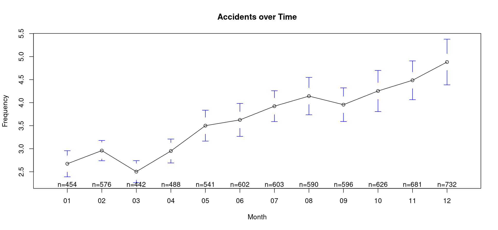
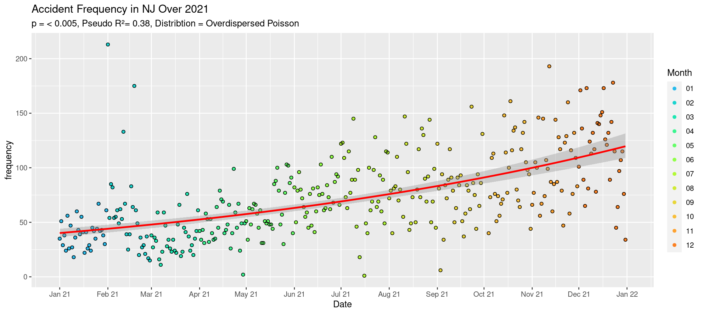

## [Project 2: Is it really more dangerous to drive in the holiday season?](https://gitlab.com/sugar_stats/holidaytraffic)

### Introduction

It is very common to hear the phrase, "Thanksgiving Eve is the most dangerous night to drive" and other warnings after attending a holiday party, but how accurate is it? This is what I intended to find out.

In order to see how accurate this statement was in New Jersey, a dataset with the traffic data from the nation was pulled from here: <https://www.kaggle.com/datasets/sobhanmoosavi/us-accidents> (cited below). The variables of interest were Date, the amount of accidents per date, and month.

After summarizing and fixing the data to grant the frequency per date, I ran 2 models. The first model was to test if month was a significant factor, and the second was to see if increasing date was a significant factor.

### Month

``` r
freqVSmonth <- glmmTMB(frequency~(Month),  family=nbinom2(),data=trafDataNJ)
fitMonth <- r.squaredGLMM(freqVSmonth)
emmeans(freqVSmonth,pairwise~Month,type = "response")
fitMonth
```



The above showed that month was statistically significant (p \< 2.2e-16) but was a relatively weak correlation (Pseudo R² = 0.06). The above also showed that the Fall/Winter Months were all statistically similar, but were statistically different from the Spring/Summer months.

### Date

``` r
freqVsDate <- glmmTMB(frequency~(Date),family="nbinom2",data=trafDataNjDate)
fitDate <- r.squaredGLMM(freqVsDate)
plot(simulateResiduals(freqVSmonth)) #QQ plot and residual plot look acceptable
check_overdispersion(freqVSmonth) #If unsure, use a poisson first and check if overdispersion exists
Anova(freqVsDate,type=2)
fitDate
```



Using date gave a much stronger correlation, with a Pseudo R² of 0.38 and a p-value of \< 2.2e-16. This shows that as the date increases from January to December, accident rates appear to increase! Since the holiday season is generally at the end of the year, this does support the hypothesis that the holiday season is more dangerous to drive in.

### Conclusion

This study is not the end-all, be-all on this topic. One major issue is that while this dataset had multiple years, accidents increased rapidly each year for NJ. I hightly doubt that there were only 500 accidents in the state in the year 2017, and this number quadrupled in 2021. The most obvious answer is that certain agencies began reporting in 2021, or certain sources were missed when this dataset was created. It is very possible that in 2021 this same issue was occuring, where in January it was lower due to the dataset having more accident data as it becomes more recent. 

For now, however, my curiousity is sated and I see that the holiday season should definitely be a time of high alert when driving. 


Moosavi, Sobhan, Mohammad Hossein Samavatian, Srinivasan Parthasarathy, and Rajiv Ramnath. "A Countrywide Traffic Accident Dataset.", 2019.

Moosavi, Sobhan, Mohammad Hossein Samavatian, Srinivasan Parthasarathy, Radu Teodorescu, and Rajiv Ramnath. "Accident Risk Prediction based on Heterogeneous Sparse Data: New Dataset and Insights." In proceedings of the 27th ACM SIGSPATIAL International Conference on Advances in Geographic Information Systems, ACM, 2019.
